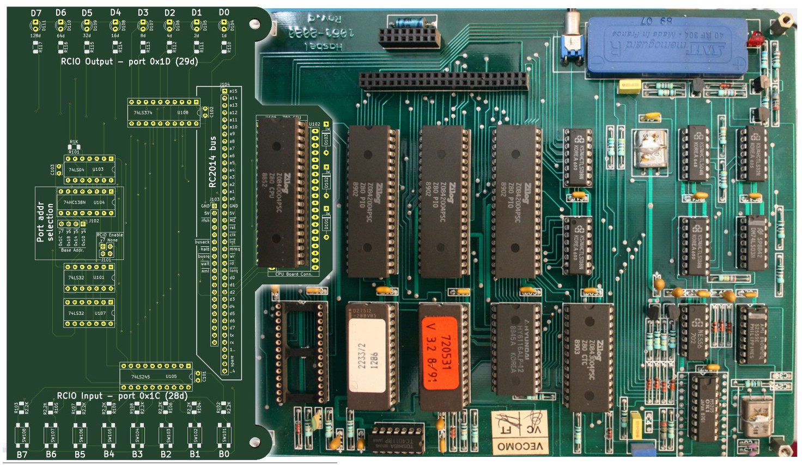
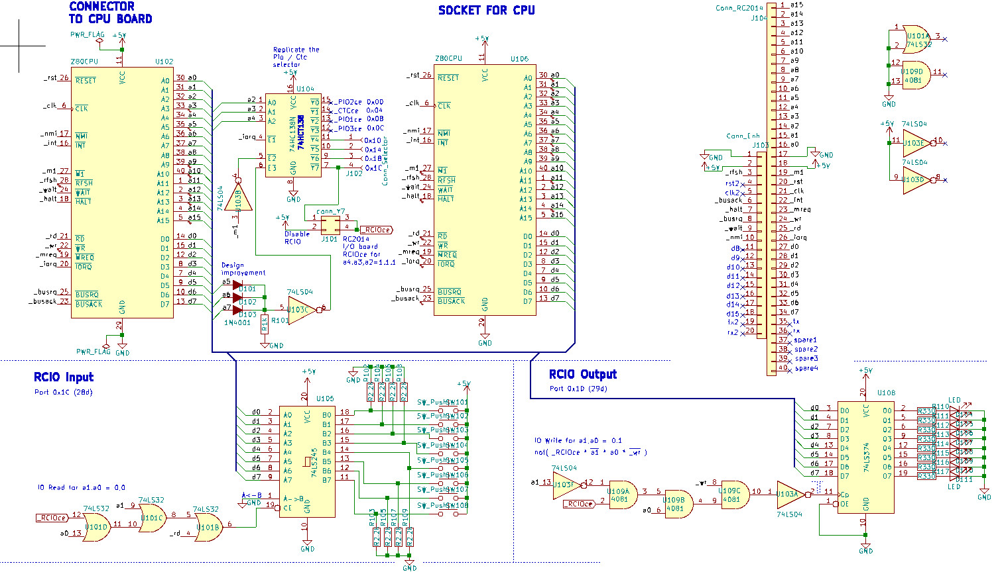

# CPU-BOARD-ADDON aka RCIO

The CPU-BOARD have been designed to deal with analogic phone system (via analog-board and interface-board). In its initial state, the CPU-BOARD does not have HMI (Human Machine Interface) to allow the user to deal with the CPU-BOARD.

-1.0.jpg)

The aim of the CPU-BOARD-ADDON is to overcome this limitation with the following features:
* The CPU-BOARD-ADDON is inserted between the Z80 CPU and the CPU-BOARD, so we have access to all the buses and all the CPU signals
* **Append 8 bits outputs** (LEDs) directly controled by a IO port. Requires only 2 instructions `ld a, 0xFF` followed by `out (0x1D),a`
* **Append 8 bits inputs** (button) directly accessible on IO port. Requires only 2 instructions `in a,(0x1C)` followed by `ld d,a`.
* **RC2014 compatible bus** exposing all the CPU signals. The RC2014 bus will be used to append additional expansion boards like [SIO-ADDON](../SIO-ADDON), [I2C-ADDON](../I2C-ADDON), etc.

The additional Input/Ouput will be very handy as basic HMI interface for testing the initial ASSEMBLY on the CPU-BOARD.

Notice: The "RCIO" comes from contraction of **RC**2014 bus and additional **I/O** .

The CPU-BOARD-ADDON will take place as follow on the CPU-BOARD.

# Schematic

Schematic is also available as PDF:
* [CPU-BOARD-ADDON-1.0.pdf](docs/CPU-BOARD-ADDON-1.0.pdf) pdf
* [CPU-BOARD-ADDON-1.1.pdf](docs/CPU-BOARD-ADDON-1.1.pdf) pdf

# Testing code

They are available on the [Z80-ASM/](../Z80-ASM) folder
