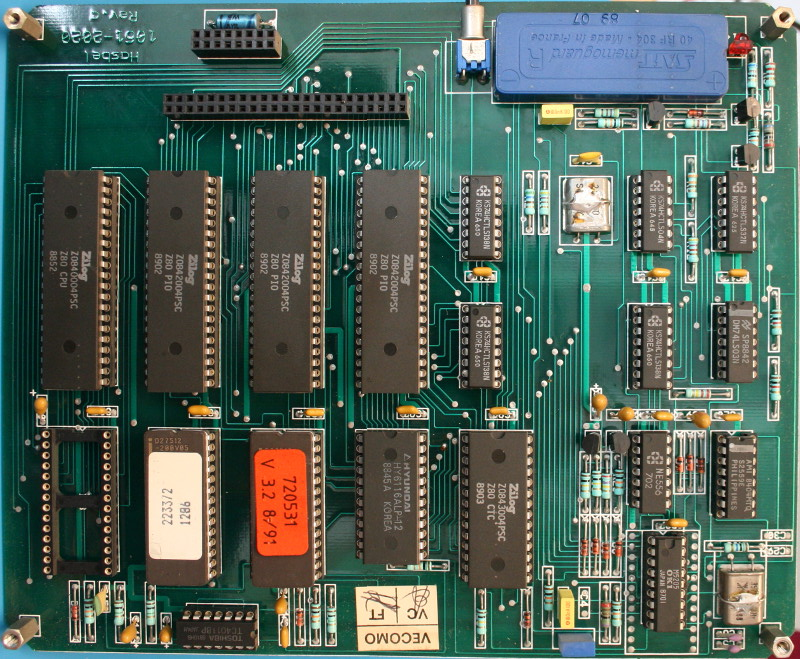
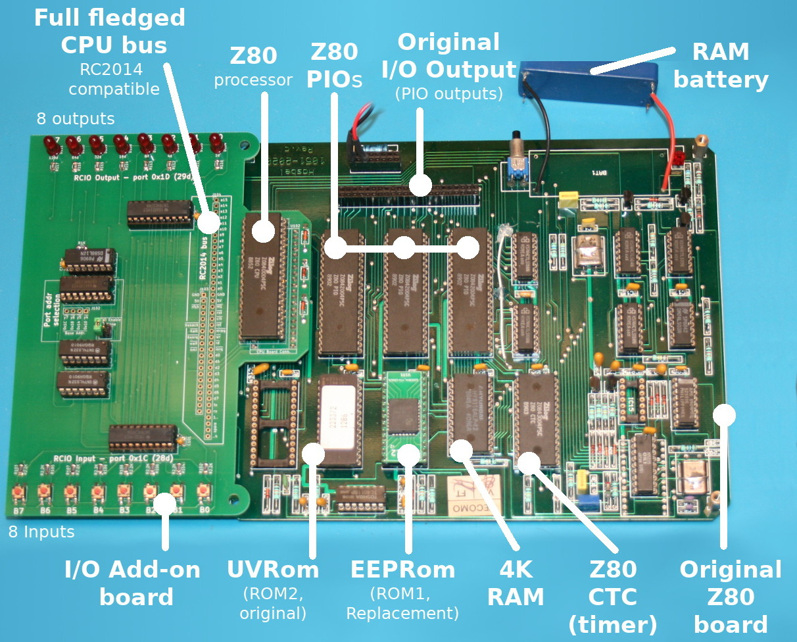
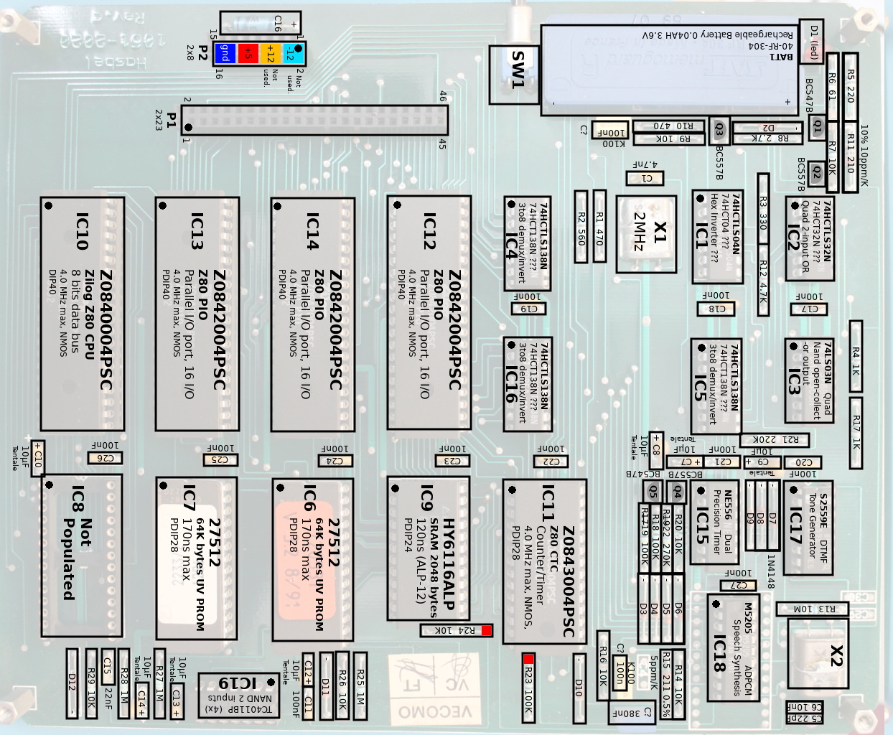
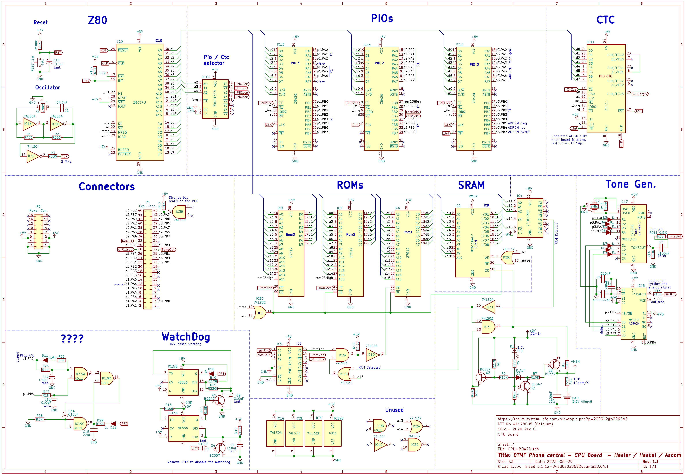
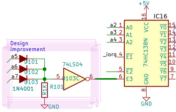
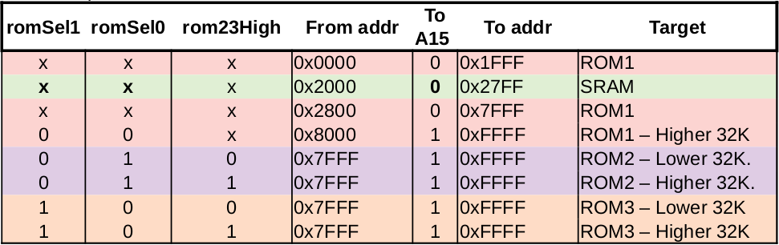

# Haskel Z80 CPU-BOARD

Here follows the main board of DTMF central that is the base of the project

Here an human friendly identification of the various components. The picture shows the CPU-BOARD-ADDON (aka RCIO) expansion board and the new EEPROM (more easy to program than UVROM)

Before drawing the schematic from the board, all components were fully qualified (component identification, Label on circuit, value).

 Then trace between component were completely identified and the schematic reverse-engineered. The schematic is drawed with Kicad.

 

Schematic also available as PDF:
* [CPU-BOARD 1.1](docs/CPU-BOARD-1.1.pdf)
* [CPU-BOARD 1.1b](docs/CPU-BOARD-1.1b.pdf)

## CPU-Board Improvement

The original board doesn't care about the un-used I/O address space.

As there is no component on those addresses, the Haskel program would not use them. No extra electronic have been added to avoids accidental component (RAM/ROM/CTC/PIO) re-selection on higher I/O address space.

As I want to append expansion boards, I must reinforce the chip selection on the CPU board. It is quite easy to do (same tip as used on the RC2014).

The improvement uses a E3 (Enable) signal on the IC16 74HC138 (not yet used on the original board and tied to +5V).

A simple diode + resistor bridge checks if an Higher I/O address space is selected THEN invert the signal with an inverter (74LS04, several of them are still available on the board)

Finally the inverted signal is feeded in the E3 pin of the 74HC138.

[The CPU-BOARD modification in picture can be viewed in the Z80-ASM/ sub-folder.](../Z80-ASM)

## Address Space

The CPU-BOARD can hold 3x 64K ROM and 2K of RAM.

The Z80 address space of 64K is shared betwwen ROM and RAM. So it exists some selection mecanism to switch the active ROM.

## Documentation
* [adressing.pdf](docs/adressing.pdf) : ROM/RAM selection mecanism.
* [io-access.pdf](docs/io-access.pdf) : PIO,CTC device selection mecanism.
* [watchdog.pdf](docs/watchdog.pdf) : How does the Watchdog work ? How to disable it (because is resets the board!)
