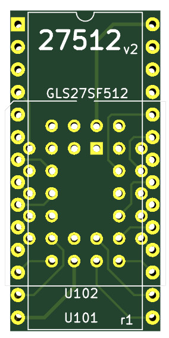

# 27512 UVProm replacement - version 2

This is an enhanced version of the [first adapter board](../EPROM-27512-GLS27SF512) (see there for more details).

This version uses a PLCC 32 socket to receive the GLS27SF512 Flash.

Also made with Kicad.
