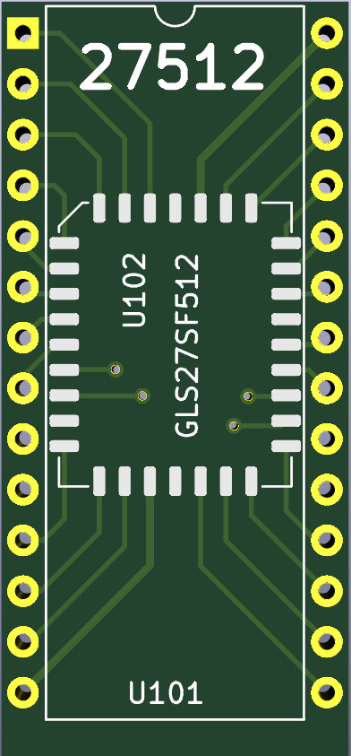

# 27512 UVProm replacement

The original board is fit with 27512 UVProm (64 Ko) actif as ROM.

Writing such UVProm requires special hardware to erase them (30 minutes into an UltraViolet Light Eraser).

So I decided to replace it with 64K 5V compatible Flash memory.

## Introducing the GL27SF512

The 27512 constraint is very inconvenient for conducting learning and tests.

So I decided to replace the 27512 with the compatible GL27SF512:
* GL27SF512 has 64K of Many-Time Flash Programmable memory
* GL27SF512 is 4.5 to 5V operating
* GL27SF512 has 70ns Read access time
* GL27SF512 is pin compatible with the 27512
* GL27SF512 can be programmed as a SST27SF512 EEProm on a programmer

Unfortunately, the GL27SF512 use a PLCC 32 Package instead of PDIP (as 27512)!

## 27512 Adapter board for GL27SF512
I designed a small adapter board with Kicad (source included).

The board offers a 27512 PDIP pins on which you can solder the GL27SF512.

It is a bit tricky to solder the PLCC package on the board. It is preferable to test continuity before to solder the header.

# Ressource

* [GLS27SF512 datasheet](docs/GLS27SF512.pdf) (pdf, english)
