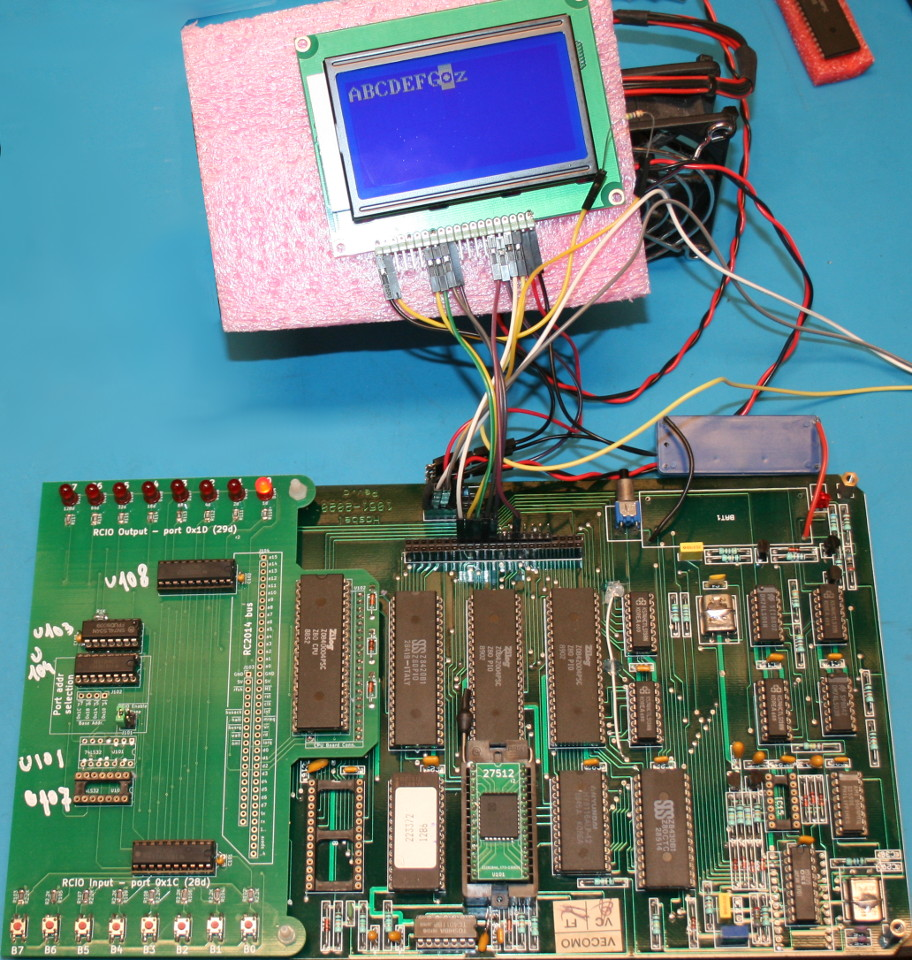
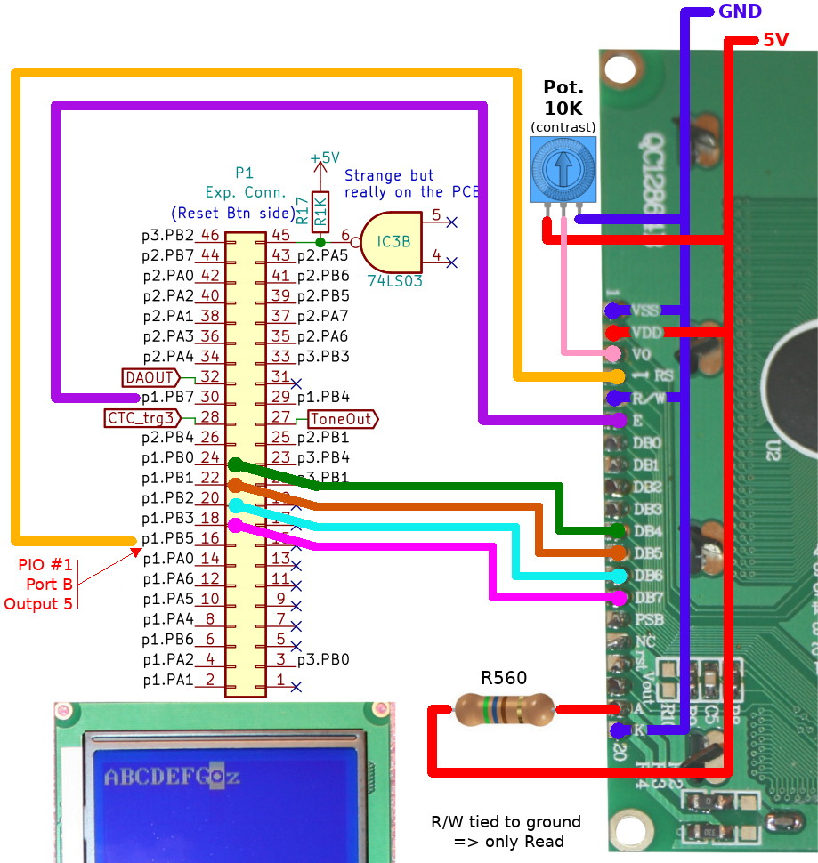

Return to parent [Z80-ASM](readme.md) readme.

# Haskel Z80 CPU-Board programming

As Arduino can drive a 16x2 or 20x4 LCD in 4 bits mode, I decided to wire such a LCD on the PIO 1 of the CPU-board then port the LiquidCrystal C library to Z80 ASM.



# Wiring

The wiring is quite simple. I used the Port B of my first PIO (available on the CPU-BOARD connector).



Here the detailled connexion

| LCD Pin  | Connected to  | Remarks |
| -------- | ------- |---------|
| VSS      | GND     |         |
| VDD      | 5V      |         |
| VO       | 0 to 5V | Contrast configuration with 10K Pot. |
| RS       | PIO B5  | Command=Low<br />Data=High |
| R/W      | GND     |         |
| E        | PIO B7  | Enable Signal |
| DB0      | _not connected_ | |
| DB1      | _not connected_ | |
| DB2      | _not connected_ | |
| DB3      | _not connected_ | |
| DB4      | PIO B0  | Bit 0   |
| DB5      | PIO B1  | Bit 1   |
| DB6      | PIO B2  | Bit 2   |
| DB7      | PIO B3  | Bit 3   |
| A        | +5V via Resistor 560 Ohms | LED power Anode |
| K        | GND     | LED power Kathode |

# Configuration

The `piolcd.asm` requires few configuration to be assembled:
```
PIOLCD_CMD: equ PIO1_BASE+PIO_PORTB+PIO_CMD   ; eg: 0x0B
PIOLCD_DATA: equ PIO1_BASE+PIO_PORTB+PIO_DATA ; eg: 0x09

LCD_W: equ 20
LCD_R: equ 4
```
* __PIOLCD_CMD__: port used to send command to the PIO (will be configured in mode 0: Output).
* __PIOLCD_DATA__: port used to send data to the PIO.
* __LCD_W__: LCD width in characters (ex: 20 chars per line)
* __LCD_R__: LCD rows (ex: 4 lines)

Note that PIO GPIO used can be rearranged in the `piolcd.asm` source, just look at the definition of `LCD_RS`, `LCD_EN`, `LCD_D4`, `LCD_D5`, `LCD_D6`, `LCD_D7`.

# API

| API Call      | Parameters  | Description              |
| ------------- | ----------- |--------------------------|
| piolcd_init   | none        | Initialize PIO port then initialize LCD   |
| piolcd_char   | e=char      | Write a byte (charater) to the LCD.       |
| piolcd_print  | hl=addr     | write a null terminated string to lcd     |
| piolcd_iprint | none        | write a immediate string (null terminated) stored just after the call statement |
| piolcd_clear  | none        | Clear the LCD                             |
| piolcd_home   | none        | Return cursor to Home                     |
| piolcd_display_on | none    | activate display                          |

# Examples

| Example       | Description               |
| ------------- | ------------------------- |
| [01_lcdinit](test-lcd/01_lcdinit.asm) | initialize LCD and write some charaters  |
| [02_print](test-lcd/02_print.asm)     | example of print statement               |
| [03_iprint](test-lcd/03_iprint.asm)   | example of iprint (immediate print)      |
| [04_home](test-lcd/04_home.asm)       | cursor home and display a counting value as binary the lcd |
