# Haskel Z80 CPU-Board programming

Here is the example and test assembly programs for the [Z80 CPU Boards](../CPU-BOARD) recovered from an old DTMF Phone central.

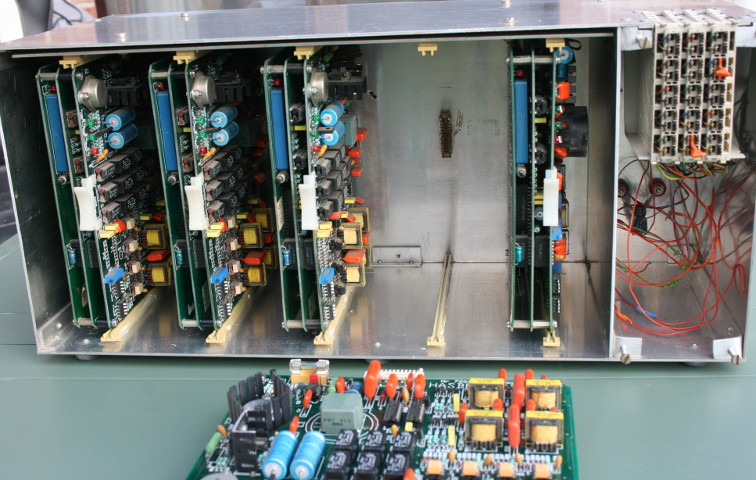

## Main board modification

**The main board have been tuned a bit to avoids CPU-BOARD chip selection for unused address range** that may now be used on custom expansion boards.

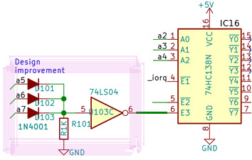

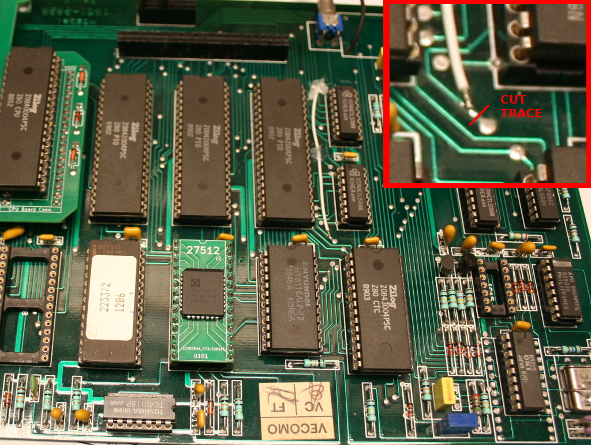

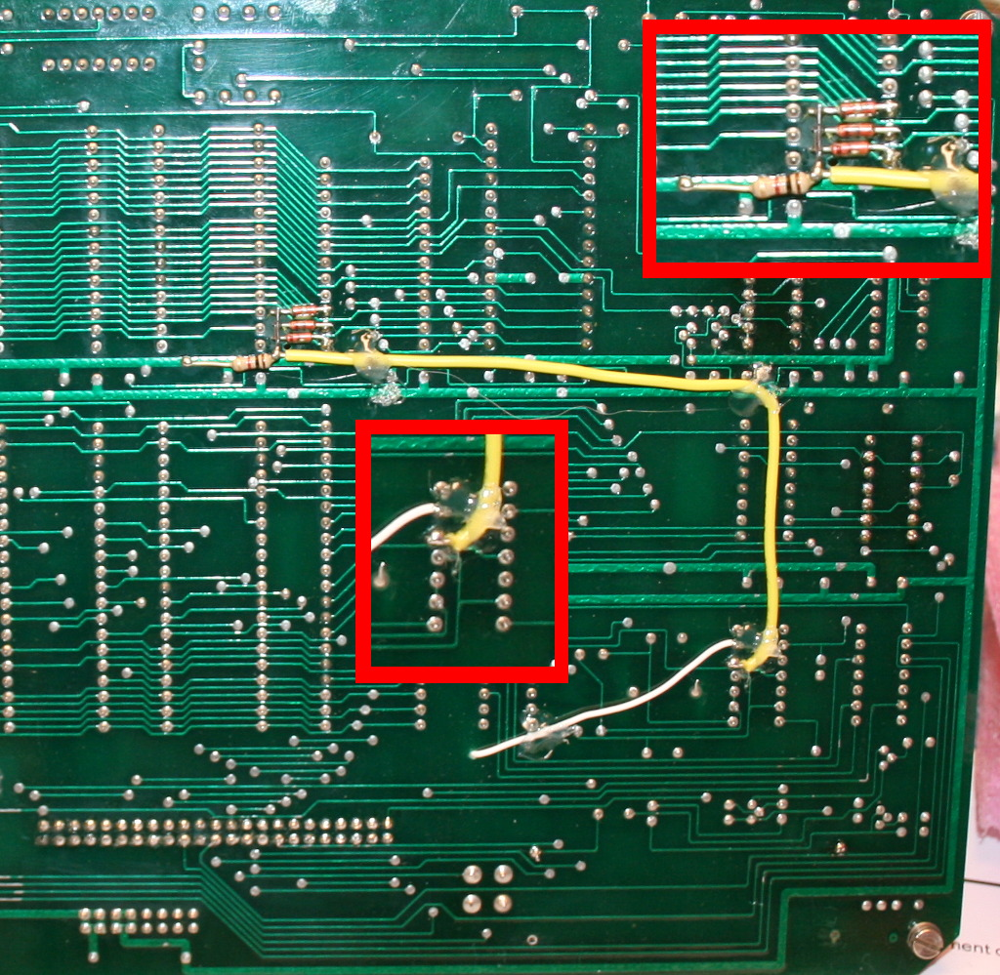

**The NE556 has been removed to avoids the WatchDog to take place** and continuously resets the board if not properly feeded.

Schematics and details are available in the [/CPU-BOARD](../CPU-BOARD) folder.

## CPU Add-on board

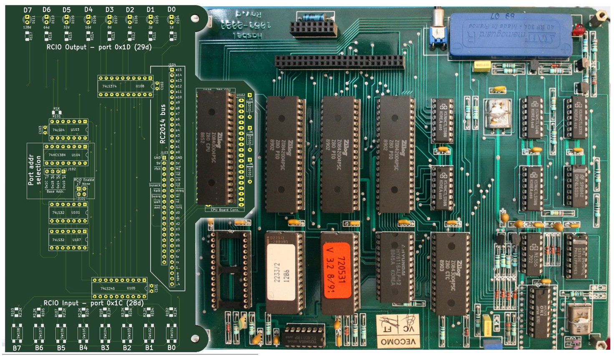

The created [CPU-BOARD-ADDON](../CPU-BOARD-ADDON) is used togheter with the CPU-BOARD and some code examples. **The CPU-BOARD-ADDON will allow primarily user interaction** with few ASM instructions where the CPU-BOARD have currently no way at all (no LED, no serial, no button) to interact with the user.

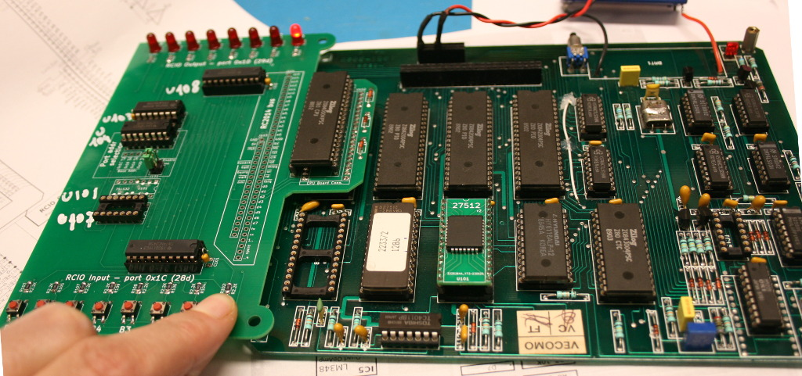

Schematics and details are available in the [/CPU-BOARD-ADDON](../CPU-BOARD-ADDON)

If you want to discover more about this retro-ingeneering story, just have a look to the following links:
* [Retro ingénierie d'une carte Z80](https://arduino103.blogspot.com/search/label/Z80-ASM) on the MCHobby's blog
* [Discussion thread of the project](https://forum.system-cfg.com/viewtopic.php?f=18&t=14526) on System.cfg forum

# Dev environment

Here how to install the **z80asm assembler** on Linux based Operating system.
It can be used with a [Makefile](test/Makefile) to compile the binaries.

```
sudo apt install z80asm
```
More information on z80asm can be found at [z80asm manpage @ Ubuntu](https://manpages.ubuntu.com/manpages/xenial/man1/z80asm.1.html).


Additional tool that may be useful to inspect generated binary file.

```
sudo apt install hexedit
```

A **programmer is also required** to program the EEPROM.
XGecu can be used and this also run under Linux :-) .

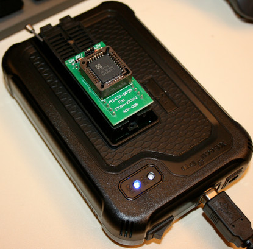

* [XGecu under linux](https://wiki.mchobby.be/index.php?title=XGecu-install-Linux) (_French_)<br />How to install and run it under Linux with Wine.
* [XGecu pratical](https://wiki.mchobby.be/index.php?title=XGecu-EEPROM) (_French_)<br />Explain how to read the ROMs and program the EEPROM for this project.


# Programming principle
1. The ASM test program is compiled to a binary file.
2. The binary is transfered to an EEPROM
3. the EEPROM is placed on CPU-BOARD (replace the ROM with RED label)

The binaries (.bin) are compiled with the **make world** utility using the Makefile to compile all the example at binaries.

```
cd test
make world
```
# Tests & Examples

The [test sub-folder](test) contains many examples in assembler used to test the various features of the CPU-BOARD and CPU-BOARD-ADDON.

## 01_minimal.asm
This is the minimal user interaction we can expect... lighting a LED.

This example will lit the four right-most LEDs (bits 0 to 4).

The code is quite simple and makes an OUT to peripheral $1D (the LEDs)

```
org     0x0000          ; Cold reset Z80 entry point.

loop:
  ld a, $0f    ; Lit LED 0, 1, 2, 3
  out ($1d),a  ; LED port
  jp loop
```
Which produces the following results on the board.

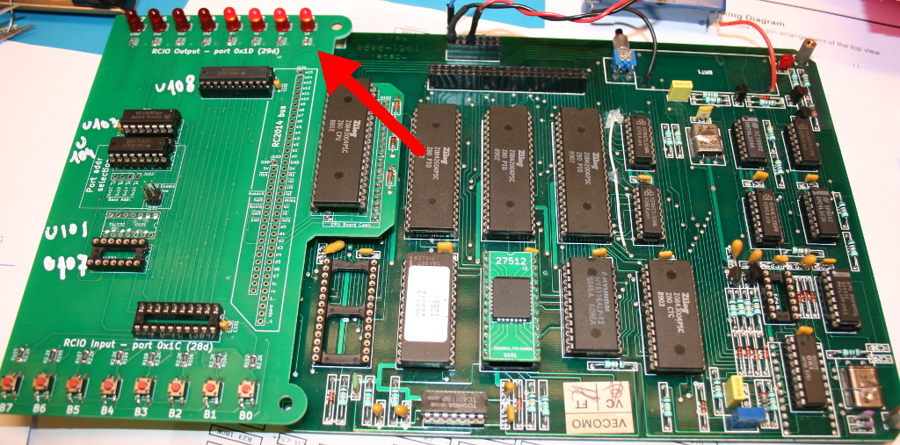

## 02_in_out.asm
This second example improve interaction by getting user input.

The example detects the pressed buttons and lit the corresponding LEDs.

The code uses a IN to read value from peripheral ($1C) THEN uses OUT to send the value to peripheral $1D .

```
org     0x0000          ; Cold reset Z80 entry point.

loop:
  in a,($1c)   ; Read buttons
  out ($1d),a  ; Apply to LEDs
  jp loop
```
Which produces the following results on the board.


## 03_pio.asm
This example will configure the port A of PIO1 as output then manipulates output PA0 to PA2 (of the 8 output available).

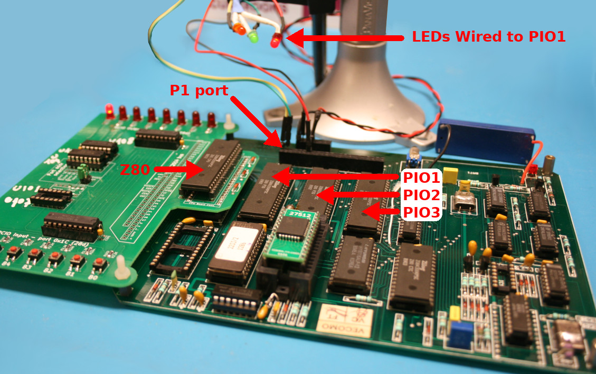

To check the changes, we do connect LEDs+resistor to the PIO lines made available on the port P1.

The pin name of port P1 (see picture below) are labelled as follow:
* p1.PA0 means PIO 1, port A, I/O 0 (PA0).
* p3.PB4 means PIO 3, port B, I/O 4 (PB4).

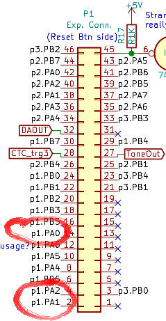

Where the [full schematics of the CPU-Board](../CPU-BOARD/docs) gives more details about pinout and adresses.

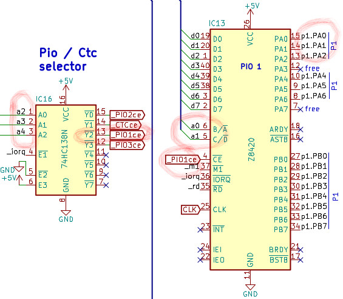

On the image above, the pins state to modify (PA0..PA2 of PIO 1) are visible on the top right of the image. Those are the signal wired to the P1 connector.

### Let's decode addresses

To manage the output, we have to control the following inputs on PIO 1:
* **B/<span style="text-decoration:overline">A</span>** feeded with a0
* **C/<span style="text-decoration:overline">D</span>** feeded with a1
* **<span style="text-decoration:overline">CE</span>** feeded with _PIO1ce

The PIO1 is activated when the <span style="text-decoration:overline">CE</span> signal is LOW. This signal comes from the <span style="text-decoration:overline">Y2</span> output of IC16 chip which must be LOW!

The <span style="text-decoration:overline">Y2</span> is LOW when input pins presents the input value 0b010 (less significative bit right). That finally means that **a4,a3,a2** = **0,1,0** .

The PIO 1 **B/<span style="text-decoration:overline">A</span>** (pin 6) feeded with a0. So when a0 is LOW, the Port A of the PIO is selected.

We have address **a4,a3,a2,a1,a0** = **0,1,0,a1,0** we will manage the PortA of PIO 1. **a5 to a7** are obviously to LOW.

Finally, the **a1** level will allows:
* when HIGH ==> send command C to PIO
* when LOW ==> send data <span style="text-decoration:overline">D</span> to PIO.

So:
* address 0b000_010_00 = 8  = 0x08 --> send data on Port A of PIO 1.
* address 0b000_010_10 = 10 = 0x0A --> send command on Port A of PIO 1.

### Assembly code

Prior to explore the assembly code, let introduce the ***io.asm*** source wich contains definitions of constants.

```
; --- PIO ---
; eg: PIO2_BASE+PIO_PORTB+PIO_CMD
PIO1_BASE:  equ  0x08 ; Base port for PIO1
PIO2_BASE:  equ  0x00
PIO3_BASE:  equ  0x0C

PIO_PORTA:  equ  0x00 ; to append to PIOx_BASE
PIO_PORTB:  equ  0x01

PIO_DATA:   equ  0x00 ; to append to PIOx_BASE
PIO_CMD:    equ  0x02

; --- RCIO ---
RCIO_OUTPUT:  equ  0x1D
RCIO_INPUT:   equ  0x1C
```
The assembly code here below just:
1. Load the ***io.asm*** .
2. Reset le LEDs on the RCIO expansion board.
3. Configure port A on PIO1 as output (mode 0).
4. Activate the output PA0 et PA1 (see the binary value 00000101).
5. Turn ON the last LED on the RCIO expansion board.<br />So we know that code have been executed. It is even visible on the sample picture at the begin of this point.

```
; 03_pio.asm
include 'io.asm'

org     0x0000               ; Cold reset Z80 entry point.

main:
    ld a, $00                ; all LEDs OFF
    out (RCIO_OUTPUT), a

    ld a,$0F                 ; set mode 0 (output)
    out (PIO1_BASE+PIO_PORTA+PIO_CMD),a

    ; set
    ld a,%00000101           ; set PA0 & PA2 high
    out (PIO1_BASE+PIO_PORTA+PIO_DATA),a

    ld a, $80                ; Lit LED D7
    out (RCIO_OUTPUT),a      
    halt
```

## 04_pio_read.asm
This example follows the preceding one (so read it first).

This time we will configure the port B of PIO1 as INPUT then read the state of a button wired on PB7 (among the 8 inputs available).

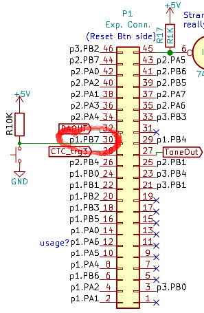
