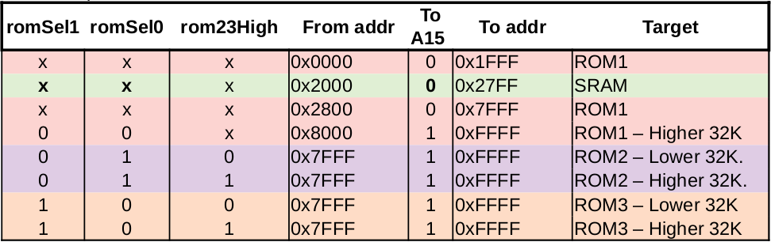
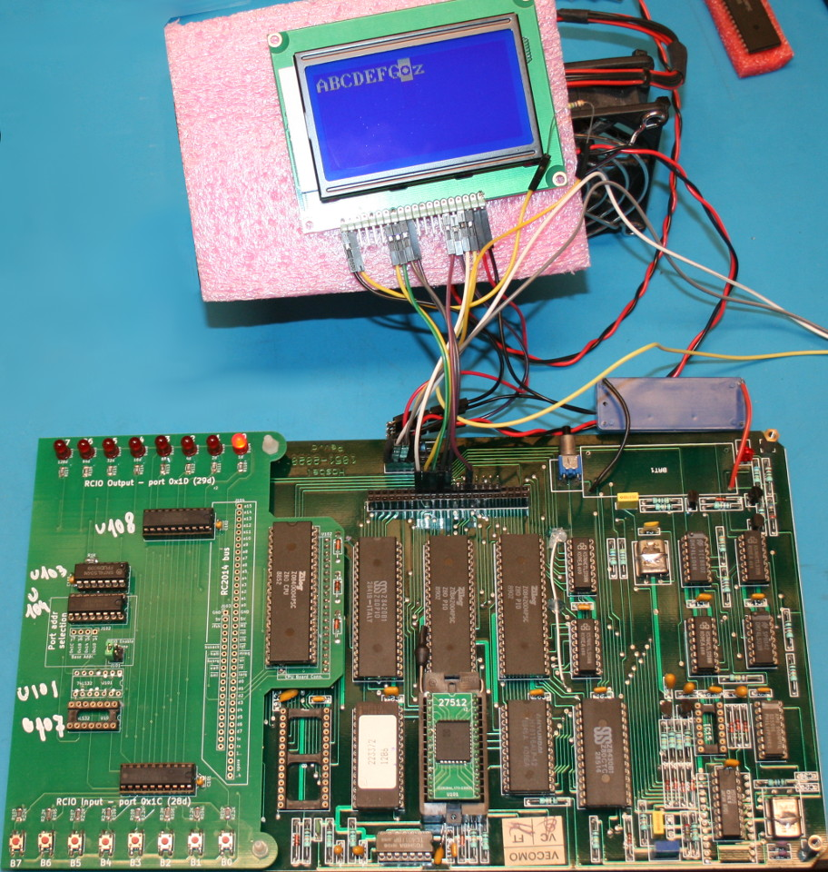

# Haskel Z80 CPU-Board programming

Here is the example and test assembly programs for the [Z80 CPU Boards](../CPU-BOARD) recovered from an old DTMF Phone central.


## Main board modification

**The main board have been tuned a bit to avoids CPU-BOARD chip selection for unused address range** that may now be used on custom expansion boards.


**The NE556 has been removed to avoids the WatchDog to take place** and continuously resets the board if not properly feeded.

Schematics and details are available in the [/CPU-BOARD](../CPU-BOARD) folder.

## CPU Add-on board


The created [CPU-BOARD-ADDON](../CPU-BOARD-ADDON) is used togheter with the CPU-BOARD and some code examples. **The CPU-BOARD-ADDON will allow primarily user interaction** with few ASM instructions where the CPU-BOARD have currently no way at all (no LED, no serial, no button) to interact with the user.


Schematics and details are available in the [/CPU-BOARD-ADDON](../CPU-BOARD-ADDON)

If you want to discover more about this retro-ingeneering story, just have a look to the following links:
* [Retro ingénierie d'une carte Z80](https://arduino103.blogspot.com/search/label/Z80-ASM) on the MCHobby's blog
* [Discussion thread of the project](https://forum.system-cfg.com/viewtopic.php?f=18&t=14526) on System.cfg forum

# Dev environment

Here how to install the **z80asm assembler** on Linux based Operating system.
It can be used with a [Makefile](test/Makefile) to compile the binaries.

```
sudo apt install z80asm
```
More information on z80asm can be found at [z80asm manpage @ Ubuntu](https://manpages.ubuntu.com/manpages/xenial/man1/z80asm.1.html).


Additional tool that may be useful to inspect generated binary file.

```
sudo apt install hexedit
```

A **programmer is also required** to program the EEPROM.
XGecu can be used and this also run under Linux :-) .


* [XGecu under linux](https://wiki.mchobby.be/index.php?title=XGecu-install-Linux) (_French_)<br />How to install and run it under Linux with Wine.
* [XGecu pratical](https://wiki.mchobby.be/index.php?title=XGecu-EEPROM) (_French_)<br />Explain how to read the ROMs and program the EEPROM for this project.


# Programming principle
1. The ASM test program is compiled to a binary file.
2. The binary is transfered to an EEPROM
3. the EEPROM is placed on CPU-BOARD (replace the ROM with RED label)

The binaries (.bin) are compiled with the **make world** utility using the Makefile to compile all the example at binaries.

```
cd test
make world
```
# Tests & Examples

The [test sub-folder](test) contains many examples in assembler used to test the various features of the CPU-BOARD and CPU-BOARD-ADDON.

## 01_minimal.asm
This is the minimal user interaction we can expect... lighting a LED.

This example will lit the four right-most LEDs (bits 0 to 4).

The code is quite simple and makes an OUT to peripheral $1D (the LEDs)

```
org     0x0000          ; Cold reset Z80 entry point.

loop:
  ld a, $0f    ; Lit LED 0, 1, 2, 3
  out ($1d),a  ; LED port
  jp loop
```
Which produces the following results on the board.


## 02_in_out.asm
This second example improve interaction by getting user input.

The example detects the pressed buttons and lit the corresponding LEDs.

The code uses a IN to read value from peripheral ($1C) THEN uses OUT to send the value to peripheral $1D .

```
org     0x0000          ; Cold reset Z80 entry point.

loop:
  in a,($1c)   ; Read buttons
  out ($1d),a  ; Apply to LEDs
  jp loop
```
Which produces the following results on the board.


## 03_pio.asm
This example will configure the port A of PIO1 as output then manipulates output PA0 to PA2 (of the 8 output available).


To check the changes, we do connect LEDs+resistor to the PIO lines made available on the port P1.

The pin name of port P1 (see picture below) are labelled as follow:
* p1.PA0 means PIO 1, port A, I/O 0 (PA0).
* p3.PB4 means PIO 3, port B, I/O 4 (PB4).


Where the [full schematics of the CPU-Board](../CPU-BOARD/docs) gives more details about pinout and adresses.


On the image above, the pins state to modify (PA0..PA2 of PIO 1) are visible on the top right of the image. Those are the signal wired to the P1 connector.

### Let's decode addresses

To manage the output, we have to control the following inputs on PIO 1:
* **B/<span style="text-decoration:overline">A</span>** feeded with a0
* **C/<span style="text-decoration:overline">D</span>** feeded with a1
* **<span style="text-decoration:overline">CE</span>** feeded with _PIO1ce

The PIO1 is activated when the <span style="text-decoration:overline">CE</span> signal is LOW. This signal comes from the <span style="text-decoration:overline">Y2</span> output of IC16 chip which must be LOW!

The <span style="text-decoration:overline">Y2</span> is LOW when input pins presents the input value 0b010 (less significative bit right). That finally means that **a4,a3,a2** = **0,1,0** .

The PIO 1 **B/<span style="text-decoration:overline">A</span>** (pin 6) feeded with a0. So when a0 is LOW, the Port A of the PIO is selected.

We have address **a4,a3,a2,a1,a0** = **0,1,0,a1,0** we will manage the PortA of PIO 1. **a5 to a7** are obviously to LOW.

Finally, the **a1** level will allows:
* when HIGH ==> send command C to PIO
* when LOW ==> send data <span style="text-decoration:overline">D</span> to PIO.

So:
* address 0b000_010_00 = 8  = 0x08 --> send data on Port A of PIO 1.
* address 0b000_010_10 = 10 = 0x0A --> send command on Port A of PIO 1.

### Assembly code

Prior to explore the assembly code, let introduce the ***io.asm*** source wich contains definitions of constants.

```
; --- PIO ---
; eg: PIO2_BASE+PIO_PORTB+PIO_CMD
PIO1_BASE:  equ  0x08 ; Base port for PIO1
PIO2_BASE:  equ  0x00
PIO3_BASE:  equ  0x0C

PIO_PORTA:  equ  0x00 ; to append to PIOx_BASE
PIO_PORTB:  equ  0x01

PIO_DATA:   equ  0x00 ; to append to PIOx_BASE
PIO_CMD:    equ  0x02

; --- RCIO ---
RCIO_OUTPUT:  equ  0x1D
RCIO_INPUT:   equ  0x1C
```
The assembly code here below just:
1. Load the ***io.asm*** .
2. Reset le LEDs on the RCIO expansion board.
3. Configure port A on PIO1 as output (mode 0).
4. Activate the output PA0 et PA1 (see the binary value 00000101).
5. Turn ON the last LED on the RCIO expansion board.<br />So we know that code have been executed. It is even visible on the sample picture at the begin of this point.

```
; 03_pio.asm
include 'io.asm'

org     0x0000               ; Cold reset Z80 entry point.

main:
    ld a, $00                ; all LEDs OFF
    out (RCIO_OUTPUT), a

    ld a,$0F                 ; set mode 0 (output)
    out (PIO1_BASE+PIO_PORTA+PIO_CMD),a

    ; set
    ld a,%00000101           ; set PA0 & PA2 high
    out (PIO1_BASE+PIO_PORTA+PIO_DATA),a

    ld a, $80                ; Lit LED D7
    out (RCIO_OUTPUT),a      
    halt
```

## 04_pio_read.asm
This example follows the preceding one (so read it first).

The `04_pio_read.asm` will configure the PIO1 Port B as Input.

The state of the button wired on the PB7 pin will be read to update the state of LED0 on the RCIO expansion board.

The pin PB 7 (PortB 7) of PIO1 is available on P1 connector. The Push button is connected as follow:


As Wired:
* p1.PB7 is HIGH when the button IS RELEASE.
* p1.PB7 is LOW (connected directly to ground) when the button IS PRESSED.

This work with some reverse logic since the Pin is NOT HIGH when the button is pressed.


```
include 'io.asm'

org     0x0000               ; Cold reset Z80 entry point.

    ld a, $00                ; all LEDs OFF on expansion board
    out (RCIO_OUTPUT), a

main:
    ld a,$4F                 ; set mode 1 (input)
    out (PIO1_BASE+PIO_PORTB+PIO_CMD),a

read_portb:
    in a,(PIO1_BASE+PIO_PORTB+PIO_DATA)

    bit 7,a                  ; is bit 7 set in a?
    jp z,input_is_zero
    ld a, $01                ; turn LED D0 On
    jp set_user_led

input_is_zero:
    ld a, $00                ; turn LED D0 Off

set_user_led:
    out (RCIO_OUTPUT),a      ; Apply LED status to expansion board
    jp read_portb            ; proceed next reading
```

Note:
* The `bit` instruction checks if a given bit position is set (in a register). See all the variation of ["bit" on z80 Heaven.](http://z80-heaven.wikidot.com/instructions-set:bit) .
* The `bit` instruction update the Zero flag. Set to 0 when the bit=1. Set to 1 when the bit=0.
* Due to the logic used, the LED D0 is turned on when the button is released (so PB7=HIGH, so  bit 7,a is HIGH => Z flag is false/0)

## 05_stack.asm
The example follows the preceding ones (so read then first).
It will mimic the Railroad Crossing by alternating the light blink between two LEDs on the RCIO expansion board.


This time, we will initialize the stack pointer allowing us to call "_delay" sub-routine and returns from it.

This will be very handy while alternating LEDs.

### About the STACK


The stack --as it name suggest it-- stacks current address before initiate a call.
This would allow the program a jump to a sub-routine then extract (pop) the address back from the stack (to a jump back to calling point).

Stack can also be used to store some more data as register states (but we will not be managed here).


* **Stack is stored at the end of the memory space** (also named memory top).
* The stack pointer (SP register) contains the address of the LAST item added in the stack.
* Stack work in reverse by decrementing stack pointer each time it adds someting to the stack.
* The stack pointer value is decremented before adding the new value.
* When removing items from the stack, the stack pointer increase (toward the memory top)
* Stack store bytes (8 bits at the time). So when adding an address (16 bits), the stack pointer is incremented of 2 bytes.

### Assembly program

The `05_stack.asm` demonstrate the usage with the "_delay" routine wasting some time in computation (otherwise we would'n see the LEDs blinks).

The analysis of CPU-Board did allows us to discover the 2 Kio of SRAM sitting at address 0x2000 to 0x27FF.



```
include 'io.asm'

RAM_BASE: equ 0x2000 ; see CPU-BOARD addressing table
RAM_END:  equ 0x27FF

org     0x0000               ; Cold reset Z80 entry point.

RST0:                        ; Zero Reset vector (cold starting)
    ld sp,RAM_END+1          ; init stack pointer

    ld a, $00                ; all LEDs OFF
    out (RCIO_OUTPUT), a


START:
    ld a, 0x80           ; LED D7 on
    out (RCIO_OUTPUT),a  ; Apply to LEDs

    call _delay          ; insert a small delay in execution

    ld a, 0x40           ; LED D6 on
    out (RCIO_OUTPUT),a  ; Apply to LEDs

    call _delay          ; small delay

    jp START             ; restart the program
```

The `_delay` routine is also coded into the `05_stack.asm`  file.
It is just counting from 0x8000 (32768) down to 0. Then returns to the caller.

```
_delay:
    ld hl, 0x8000        ; load initial value in hl (encoded over 16 bits)
dloop:
    dec hl               ; decrement hl of 1
    ld a, h              ; load high byte into accumulator
    or l                 ; make OR with low byte of the value
                         ; When reaching 0 then all bits are 0.
                         ; Then OR operation between l & h will also have all bits set to 0
    jp nz, dloop         ; if last operation is not zero then restart decounting loop
    ret                  ; Return to callee
```

I have experienced values on 2 Mhz System Clock to find standard timing controled with trace scope.

* 0xf442 = 750 ms
* 0xa2d6 = 500 ms
* 0x516b = 250 ms (250.5 ms)
* 0x61b4 = 300 ms
* 0x40f9 = 200 ms (199.5 ms)
* 0x207C = 100 ms (99.25 ms)
* 0x103E = 50 ms
* 0x824  = 25 ms
* 0x683  = 20 ms
* 0x341  = 10 ms
* 0x1a0  = 5ms
* 0x53   = 1ms (1.040 ms)
* 0x29   = 500us (520 us)
* 0x7    = 100us (120 us)

## 06_ctc_ch1.asm

The example [test/ctc_ch1.asm](test/ctc_ch1.asm) initialize the Channel 1 of the CTC. It set the clock Prescaler to 256 and the channel counter to 256.

The result is 2 Mhz / 256 / 256 = 2.000.000 / 256 / 256 = 30.517 Hz Output Pulse!

```
include 'io.asm'

RAM_BASE: equ 0x2000 ; see CPU-BOARD addressing table
RAM_END:  equ 0x27FF

org     0x0000               ; Cold reset Z80 entry point.

RST0:
    ld sp,RAM_END+1          ; init stack pointer

    ld a, $00                ; all LEDs OFF
    out (RCIO_OUTPUT), a


START:
    ld a, 0x80           ; LED D7 Light
    out (RCIO_OUTPUT),a  ; Apply to LEDs

    ld a, %00100111      ; init CTC Ch 1 as Timer, immediate start with prescale 256
                         ; bit 7 = 0 = disable interrupt
                         ; bit 6 = 0 = timer mode
                         ; bit 5 = 1 = 256 Prescaler
                         ; bit 4 = 0 = Falling edge
                         ; bit 3 = 0 = automatic trigger when time constant is loaded
                         ; bit 2 = 1 = Time constant follows
                         ; bit 1 = 1 = Software reset
                         ; bit 0 = 1 = control command
    out (CTC_BASE + CTC_CH1), a
    ld a, 0xFF           ; set time constant.
    out (CTC_BASE + CTC_CH1), a

    ld a, 0xFF           ; All LED on
    out (RCIO_OUTPUT),a  ; Apply to LEDs

   halt
```


Using a scope on the CTC pin named "ZC/TO1", we can measure the pulse frequency


The scope measure a pulse each 32.65ms (30.6 Hz).

## 07_ctc_seconds.asm

As the output of channel 1 is connected to the trigger of the channel 0, we could combine the existing channel 1 timer with the a pulse counter setup on channel 0.

This way, it is possible get a "Seconds" base time pulse on ZC/TO0 output.

1. The CTC channel 1 timer is configured to divide the 2 Mhz clock / 256 / __251__. This will generates 31.001 pulse/sec.
2. The pulses on ZC/TO1 output feeds channel 0.
3. Channel 0 is configured to count down the 31 pulses => provide 1 pulse/sec on ZC/TC0 output.

```
RAM_BASE: equ 0x2000 ; see CPU-BOARD addressing table
RAM_END:  equ 0x27FF

org     0x0000               ; Cold reset Z80 entry point.

RST0:
    ld sp,RAM_END+1          ; init stack pointer

    ld a, $00                ; all LEDs OFF
    out (RCIO_OUTPUT), a


START:
    ld a, 0x80           ; LED D7
    out (RCIO_OUTPUT),a  ; Apply to LEDs

    ld a, %00100111      ; init CTC Ch 1 as Timer, immediate start with prescale 256
                         ; see previous example for bit configuration details
    out (CTC_BASE + CTC_CH1), a
    ld a, 251            ; set time constant. Output 31 pulse/sec
    out (CTC_BASE + CTC_CH1), a

    ld a, %01010111      ; init CTC Ch 0 as counter
                         ; bit 7 = 0 = disable interrupt
                         ; bit 6 = 1 = counter mode
                         ; bit 5 = 0 = Prescaler, don't care for counter
                         ; bit 4 = 1 = Raising edge detecion
                         ; bit 3 = 0 = don't care for counter
                         ; bit 2 = 1 = Time constant follows
                         ; bit 1 = 1 = Software reset
                         ; bit 0 = 1 = control command
    out (CTC_BASE + CTC_CH0), a
    ld a, 31             ; count 31 pulse. Output 1 pulse/sec
    out (CTC_BASE + CTC_CH0), a

    ld a, 0xFF           ; All LED on
    out (RCIO_OUTPUT),a  ; Apply to LEDs

   halt
```

As showed on the scope capture below, the output frequency of ZC/TCO is set to 1 Hz (997ms between pulses).


As pulses are not easy to view, I placed measurement on the graph.


## LCD examples

As Arduino can drive a 16x2 or 20x4 LCD in 4 bits mode, I decided to wire such a LCD on the PIO 1 of the CPU board then port the LiquidCrystal library to Z80 ASM.



I have detailed the wiring and tests in a separate [readme-piolcd](readme-piolcd.md) readme file.
