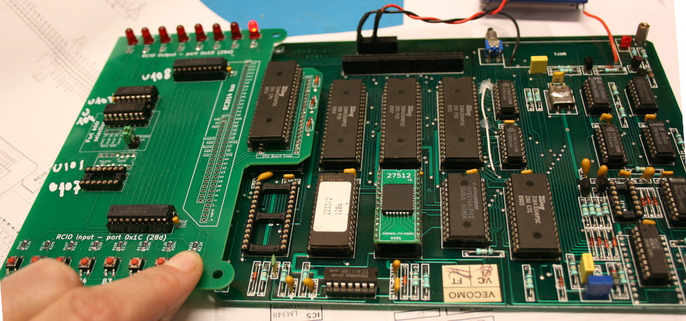

# Haskel Z80 based DTMF phone central

I wanted to explore the Z80 programming in assembly and C but have no hardware available.

After [some experiment with the great RC2014 kit](https://arduino103.blogspot.com/search/label/RC2014) able to run CP/M and using in-RAM assembly, I decided to go for a new projet.

This time I wanted to salvage a Z80 board, learn more about hardware design and hack it to expand its capabilities.

This is where I met this DTMF (tone) phone central based on Z80.

This central is composed of CPU-BOARD, Analog board and Interface board (to phone lines). The board of interest is the CPU-BOARD.

# Haskel Z80 Hack History

Here below the CPU-Board with an RCIO Input/Output expansion board plugged directly onto the Z80 CPU.

Features of the CPU-BOARD:
* 1x Z80 CPU @ 2 MHz
* 3x Z80 PIO - As many as 48 IOs
* 1x Z80 CTC - Timer / Counter
* 1x 2Ko RAM
* 3x 32Ko ROM
* 1x Watchdog circuitery (IC15 removed to disable)
* 1x DTMF generator
* 1x 46 pins PIO connector (P1)
* 1x 16 pins PWR connector (P2)
 * 5 Volts
 * +12 Volts (not used on CPU-BOARD)
 * -12 Volts (not used on CPU-BOARD)

Here an history of the projet developemnt

| **Date** | **Folder** | **Description** |
|----------|------------|-----------------|
| Jun 2023 | [CPU-BOARD/](CPU-BOARD) |  Reverse engineered of the main CPU board with Kicad schematic, memory addressing, hacking (to add expansion boards), etc |
| Jun 2023 | [EPROM-27512-GLS27SF512/](EPROM-27512-GLS27SF512) | Replacing the UVProm by an EEPROM (GLS27SF512 erasable Flash) |
| Jun 2023 | [PROGRAMMER-GLS27SF512/](PROGRAMMER-GLS27SF512) | Attempt to create a MicroPython programmer for GLS27SF512 Flash (**Doesn't works on writing!**, I now use a XGecu Pro)
| Aug 2023 | [EPROM-27512-GLS27SF512-v2/](EPROM-27512-GLS27SF512-v2) | Also a replacement of the UVProm but using a socket for the PLCC Flash component |
| oct 2023 | [CPU-BOARD-ADDON/](CPU-BOARD-ADDON) | This companion board is also named "RCIO" because it brings a RC2014 like expansion port, 8x I/O input (button) and 8x output (LED). This board will plug directly on the Z80 cpu and allow additionnal expansion to be plugged on the CPU board.|
| Sep 2023 | [Z80-ASM/](Z80-ASM) | Programming and learning Z80 step by step. ASM libraries and examples. |
| Nov 2023 | [Z80-ASM/test-lcd/](Z80-ASM/test-lcd) | Driving a 20x4 LCD display from the CPU-BOARD PIO. |
| --- | SIO-ADDON/ | **Under construction** Serial Interface for the CPU-BOARD. |
| --- | I2C-ADDON/ | **Under construction** I2C interface for the CPU-BOARD.    |
| --- | ANALOG-BOARD/ | **Under construction** Reverse engineering of the Analog board (and its usage with the CPU board).    |

# More information

If you want to discover more about this retro-ingeneering story, just have a look to the following links:
* [Retro ingénierie d'une carte Z80](https://arduino103.blogspot.com/search/label/Z80-ASM) on the MCHobby's blog
* [Discussion thread of the project](https://forum.system-cfg.com/viewtopic.php?f=18&t=14526) on System.cfg forum
