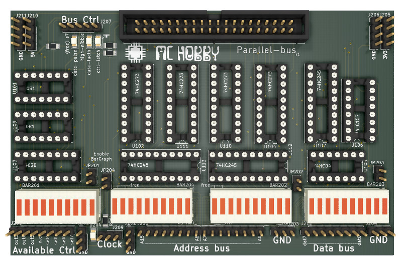
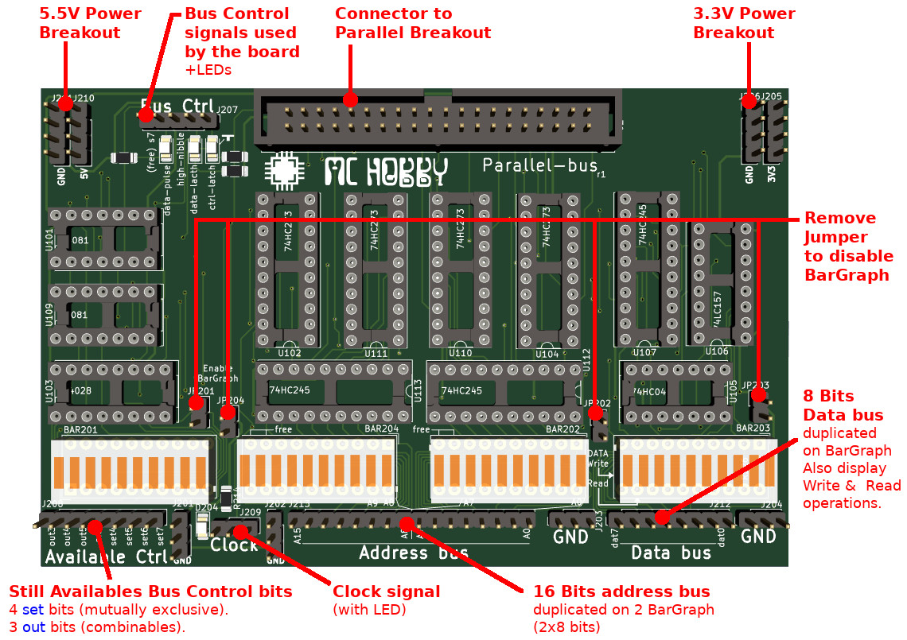
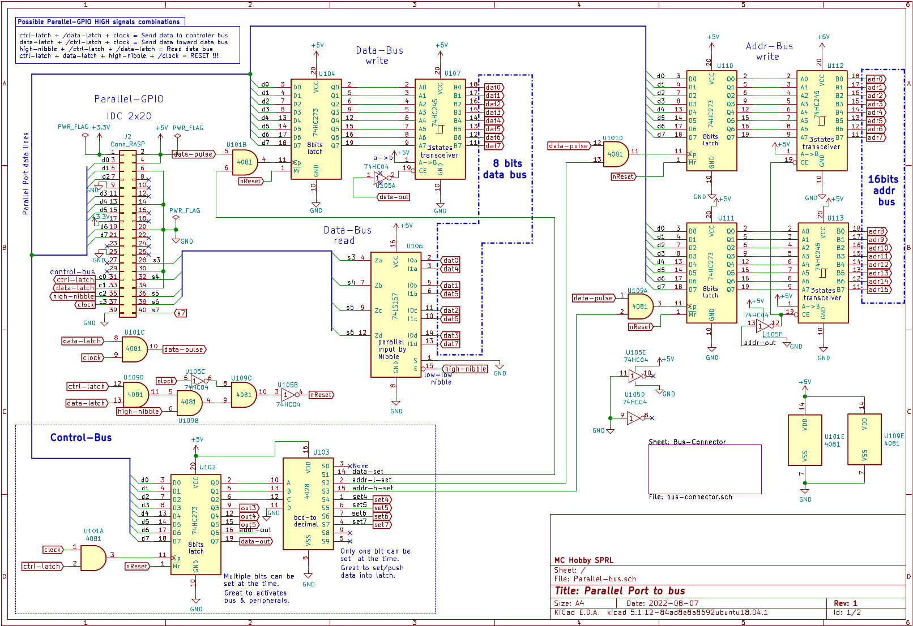
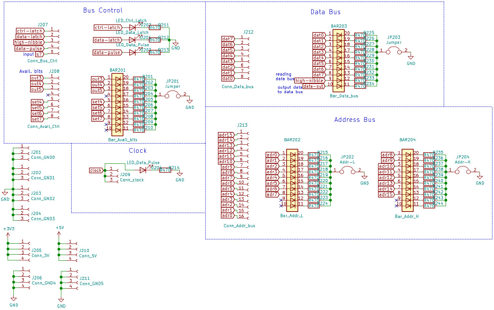

# Parallel Bus : create Data bus + Address bus + Control bus from parallel port



The aim of this board is to create a variety of data buses to interface a computer (via its parallel port) to offer the possibility to test 16bits alike devices/chips.

This board is designed to be used with python script.



Features:
* The data bus is 8 bits wide like any retro-computer.
* The address bis is 16 bits wide, it is quite large but would allow usage of higher addresses lines to enable chips.
* The control bus is not fully used. The available bits can be used in your own setup to expand the board

__Remark:__ This board is designed for testing, not for performance and speed.

# Schematics





Schematics are also available at PDF format: [PDF page 1](docs/Parallel-bus.pdf), [PDF page 2](docs/bus-connector-Bus-Connector.pdf).

# Board Reset

The data latches (control Bus, Data Bus, Address Bus) can all be reset by a single operation via the parallel port.

The `reset` signal is issued by the following signal combination:

`ctrl-latch AND data-latch AND high-nibble AND not(clock)`

which is translated to:

```
ctrl-latch  = HIGH
data-latch  = HIGH
high-nibble = HIGH
clock       = low
```

# Write the data bus

The following details how to write 0xAE to the Data-Bus.

Not relevant bits are marked `unchanged/?`, their states doesn't impact the aimed operation.

## Step 1: active data-set on ctrl bus

The `data-set` signal (on U103) will allow the U104 latch to store data to be send (at a later stage) on the 8 bit data bus.

```
data-latch = low
ctrl-latch = HIGH
high-nibble = low
clock = low

set parallel-data = 0b000????0
  Q0,Q1,Q2 = 1,0,0 -> data-set = HIGH --> prepare to latch data on U104
  OUT3..OUT5 = unchanged/?
  addr-out   = unchanged/?
  data-out   = low --> U107 transceiver doesn't push data to data bus!

clock = HIGH
clock = low
```

## Step 2: Push 0xAE to data bus latch (U104)

As the `data-set` signal is now active, we can place the data on the parallel port and then pulse the `clock` signal to effectively store the data in the latch (U104)

```
data-latch = HIGH
ctrl-latch = low
high-nibble = low
clock = low

set parallel-data = 0b10101110 (0xAE)
clock = high # data-pulse --> inject in U104
clock = low
```

## Step 3: reset data-set on ctrl bus

As the data is now stored we can disable the `data-set` signal in U103.

```
data-latch = low
ctrl-latch = HIGH
high-nibble = low
clock = low

set parallel-data = 0b000????0
  Q0,Q1,Q2 = 0,0,0 -> S0 = None = HIGH --> release latch U104
  OUT3..OUT5 = unchanged/?
  addr-out   = unchanged/?
  data-out   = low --> U107 transceiver doesn't push data to data bus!

clock = HIGH
clock = low
```

## Step 4: Send the data to the Bus

Now, we will write the data to the bus. To do so, we will enable the U107 transceiver from A->B.

When U107 is enabled, it will force the state of data bus lines.

To enable the transceiver the `data-out` signal must be set high on the U102.

```
data-latch = low
ctrl-latch = HIGH
high-nibble = low
clock = low

set parallel-data = 0b000????1
  Q0,Q1,Q2 = 0,0,0 -> S0 = None = HIGH --> release latch U104
  OUT3..OUT5 = unchanged/?
  addr-out   = unchanged/?
  data-out   = HIGH --> U107 transceiver push data to data bus!

clock = HIGH
clock = low
```
Voila, 0xAE is now present on the data-bus

# Reading the data bus

The data bus can be read at any time. Only the `high-nibble` signal must be manipulated to get the data from data-bus.

## Step 1: Reading the low nibble

The LowBits can be read on the "S" lignes of the parallel port.

```
data-latch = low
ctrl-latch = low
high-nibble = low
clock = low
```
The `LowBits` = 0b(s6,s5,s4,s3) with s3 being the less significant bit.

## Step 2: Reading the high nibble

The LowBits can be read on the "S" lignes of the parallel port.

```
data-latch = low
ctrl-latch = low
high-nibble = HIGH
clock = low
```
The `HighBits` = 0b(s6,s5,s4,s3) with s3 being the less significant bit.

## Step 3: Calculating Bus Data

Data value is calculated with a Shift Register operation

`value = (HighBits << 4) + LowBits`

Voilà!

# Writing an Address

The following steps shows how to write the address 0xFFEE on the adress bus.

Not relevant bits are marked `unchanged/?`, their states doesn't impact the aimed operation.

## Step 1: active addr-h-set on ctrl bus

The `addr-h-set` signal (on U103) will allow the U111 latch to store the Higher 8 bits to be send (at a later stage) on the 16 bit address bus.

```
data-latch = low
ctrl-latch = HIGH
high-nibble = low
clock = low

set parallel-data = 0b000???0?
  Q0,Q1,Q2 = 1,1,0 -> addr-h-set = HIGH --> prepare to latch data on U111
  OUT3..OUT5 = unchanged/?
  addr-out   = low --> U113 & U112 transceivers doesn't push data to address bus!
  data-out   = unchanged/?

clock = HIGH
clock = low
```

## Step 2: Push 0xFF to address bus latch (U111)

As the `addr-h-set` signal is now active, we can place the data on the parallel port and then pulse the `clock` signal to effectively store the data in the latch (U111)

```
data-latch = HIGH
ctrl-latch = low
high-nibble = low
clock = low

set parallel-data = 0b11111111 (0xFF)
clock = high # data-pulse --> inject in U111
clock = low
```

## Step 3: active addr-l-set on ctrl bus

The `addr-l-set` signal (on U103) will allow the U110 latch to store the Lower 8 bits to be send (at a later stage) on the 16 bit address bus.

```
data-latch = low
ctrl-latch = HIGH
high-nibble = low
clock = low

set parallel-data = 0b000???0?
  Q0,Q1,Q2 = 0,1,0 -> addr-l-set = HIGH --> prepare to latch data on U110
  OUT3..OUT5 = unchanged/?
  addr-out   = low --> U113 & U112 transceivers doesn't push data to address bus!
  data-out   = unchanged/?

clock = HIGH
clock = low
```

## Step 4: Push 0xEE to address bus latch (U110)

As the `addr-l-set` signal is now active, we can place the data on the parallel port and then pulse the `clock` signal to effectively store the data in the latch (U110)

```
data-latch = HIGH
ctrl-latch = low
high-nibble = low
clock = low

set parallel-data = 0b11101110 (0xEE)
clock = high # data-pulse --> inject in U110
clock = low
```


## Step 5: reset data-set on ctrl bus

As the address is now stored in U110 we can disable the `addr-l-set` signal in U110.

```
data-latch = low
ctrl-latch = HIGH
high-nibble = low
clock = low

set parallel-data = 0b000???0?
  Q0,Q1,Q2 = 0,0,0 -> S0 = None = HIGH
  OUT3..OUT5 = unchanged/?
	addr-out   = low --> U113 & U112 transceivers doesn't push data to address bus!
  data-out   = unchanged/?

clock = HIGH
clock = low
```

## Step 6: Send the data to the Bus

Now, we will write the address to the address bus. To do so, we will enable the U112 & U113 transceiver from A->B.

To enable the transceivers the `addr-out` signal must be set high on the U102.

```
data-latch = low
ctrl-latch = HIGH
high-nibble = low
clock = low

set parallel-data = 0b000???1?
  Q0,Q1,Q2 = 0,0,0 -> S0 = None = HIGH
  OUT3..OUT5 = unchanged/?
	addr-out   = HIGH --> U113 & U112 transceivers push address to address bus!
  data-out   = unchanged/?

clock = HIGH
clock = low
```

Voilà, it is done.
