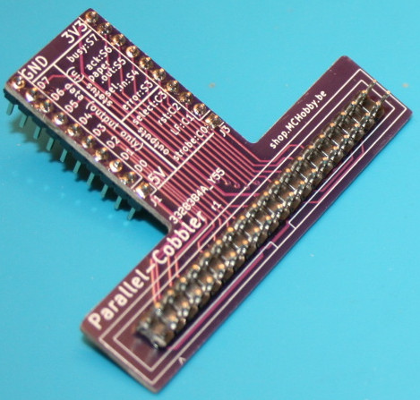

# Parallel Cobbler : parallel GPIO to Cobbler

Make th 2x20 GPIO translated to a Cobbler.

 __Please remember that Logic level is 5V only__.

Using a Cobbler with a breadboard will make the prototyping tasks so easy.

## Status

Status: Completed
