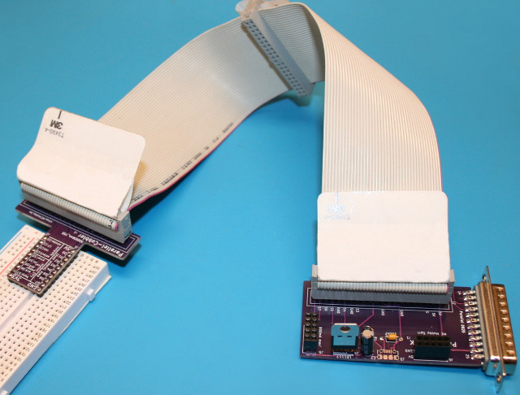
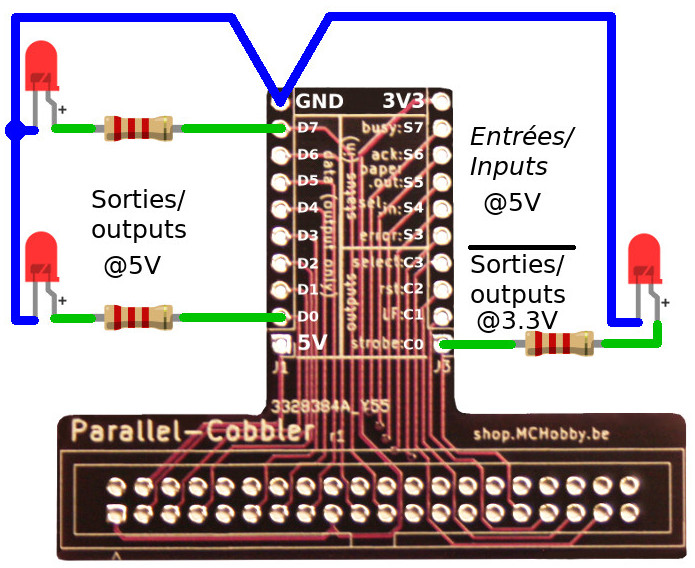
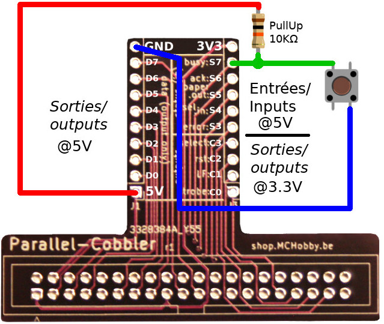

# Parallel-Breakout retro development project with Linux & Python

## A bit a history

I wanted to re-discover __Parallel port development__ on older computer with Python (see [Dell Optiplex GX260](https://arduino103.blogspot.com/search?q=optiplex) and [HP NC6000](https://arduino103.blogspot.com/search?q=nc6000) salvage).

Those are quite old computers as the OPtiplex is date from 2002 (2007 for the NC6000) and I wanted to used more modern operating system for development.

[Linux Bionic Puppy and Fossa Puppy](https://puppylinux-woof-ce.github.io/) (derivated from Ubuntu Linux) does a really great job to modernise the operating system.

## Browsing sub-projects

This project is made of many sub-project. Just navigates the various sub-folder to gets more information about them. I stored readme files into each sub-folder to give some details about that part of the project.

The main items [Parallel-brk](Parallel-brk) and [Parallel-cobbler](Parallel-cobbler)  detailled here below.  

## Prototyping Hardware
From there, I started to design 2 first boards to facilitate test and prototyping.

The board are shares in the following sub-directories, __please keep the credit__:

* [Parallel-brk](Parallel-brk) : breakouts the Parallel port to a 2x20 connector (like Raspberry-Pi) and inject 3.3 + 5V at the right place on the GPIOs
* [Parallel-cobbler](Parallel-cobbler) : translate the 2x20 pinout to a prototyping Cobbler. Cobbler  a board that can be plugged onto a breadboard to make prototyping. The 5V and 3.3V are also available on the breakout so we are ready to prototype stuff!

__/!\ 5V Logic /!\__ warning the parallel port is 5V logic only!

## Installing pyparallel

Developping parallel port stuff with Python would requires to install the `pyparallel` package.

We have described the __python3-parallel__ (0.2.2-2) ["Linux Package Installation" in this article](https://arduino103.blogspot.com/2022/06/recuperation-dell-optiplex-gx260n-et_01622143827.html) to support PyParallel on my Linux Puppy (still written in french, ask google for translation)

## Inital Input/Output test

The article "[Parallel Breakout: test d'entrée/sortie en python](https://arduino103.blogspot.com/2022/07/parallel-breakout-tests-dentreesorties.html)" (Google may help to translate) shows how to wire input and outpout on the breakout and how to drive them from Python.

The Parallel port do have 8 output data bit (D0..D7).

The parallel port also brings 5 inputs bits and 4 additional output bits (C0..C4 that can be switched to input... but not recommended).

The Python code is [available here](https://arduino103.blogspot.com/2022/07/parallel-breakout-tests-dentreesorties.html).

# Ressources
* [All the "Parallel-Breakout" articles available on the blog](https://arduino103.blogspot.com/search?q=parallel-breakout) (_french_)
