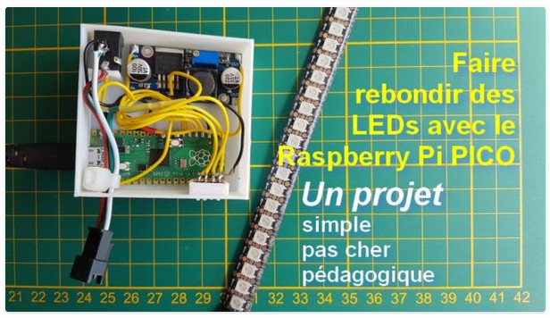
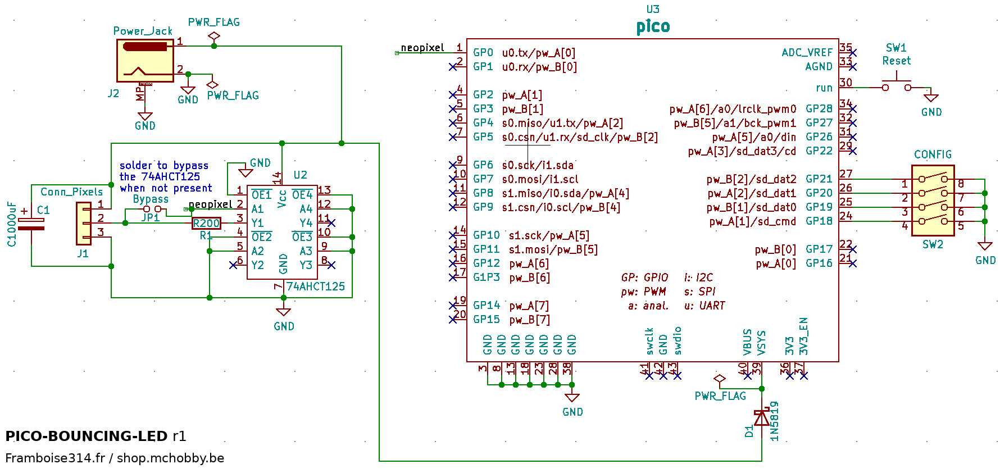
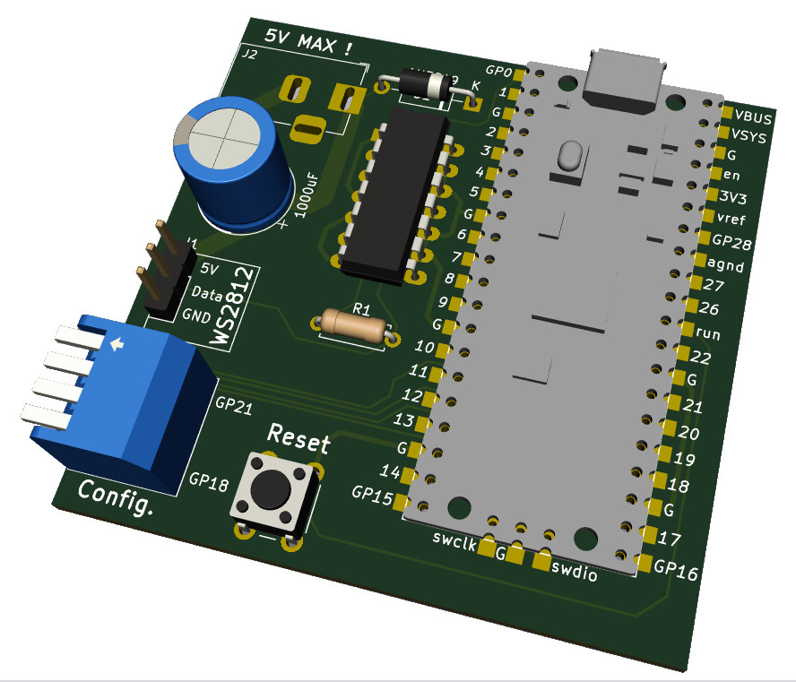
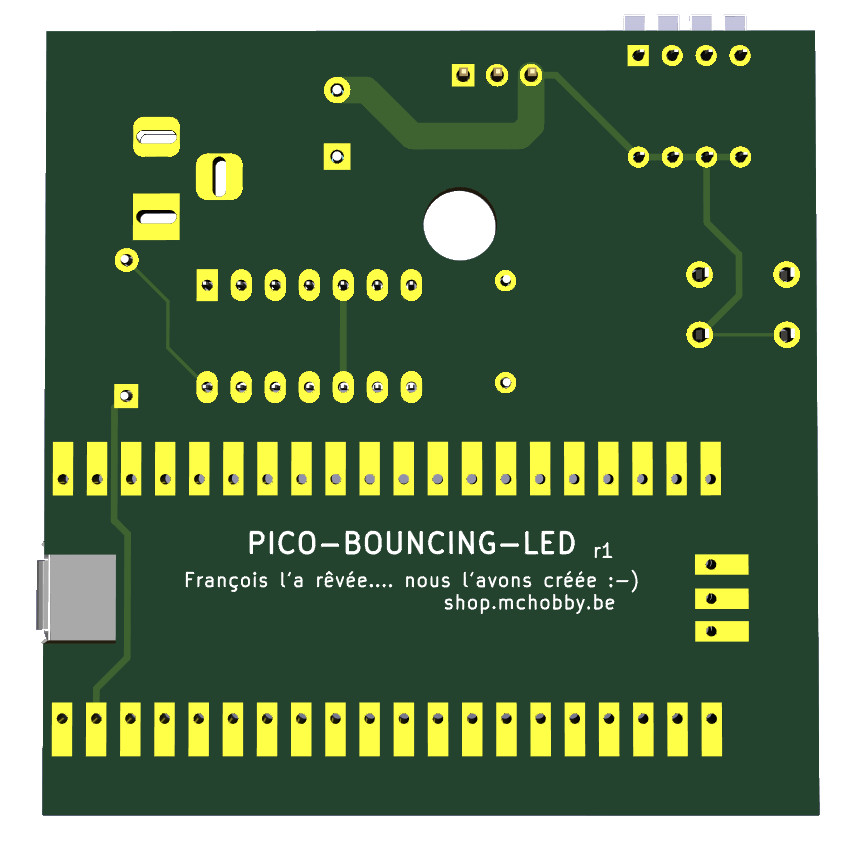
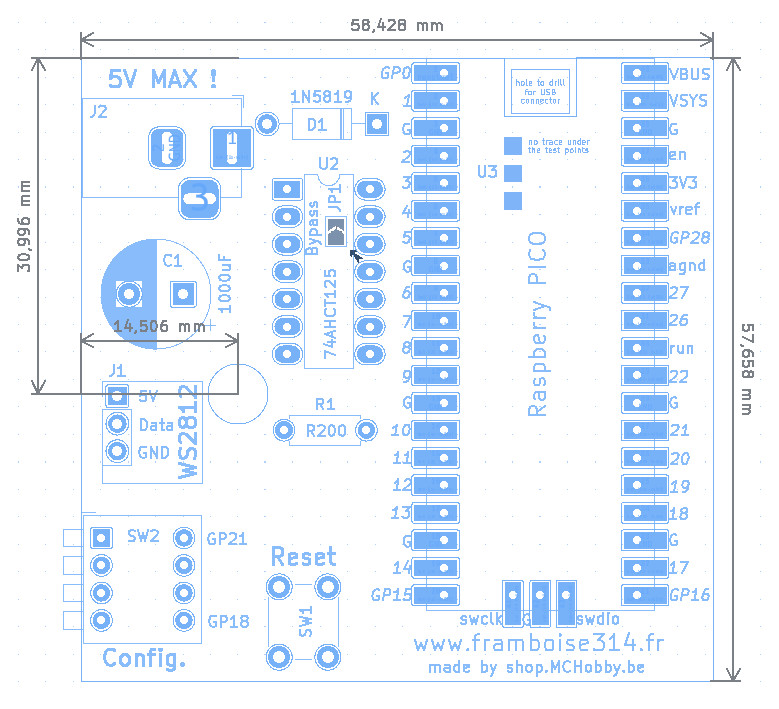

# Raspberry-Pi PICO bouncing LED

Faire rebondir des LEDs NeoPixel / WS2812 avec un Raspberry-Pi Pico sous MicroPython.

Un projet original de Framboise314 ( [voyez ce lien](https://www.framboise314.fr/faites-rebondir-les-led-avec-le-raspberry-pi-pico-episode-2/) ).

# Détails

Voyez l'archive ZIP pour les fichiers de fabrications.

