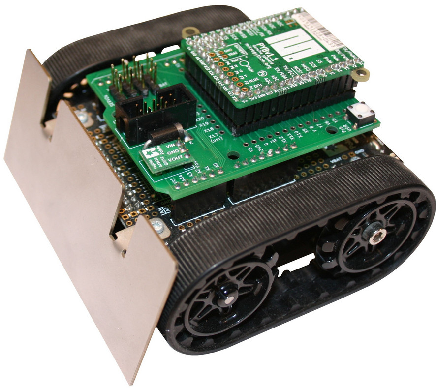
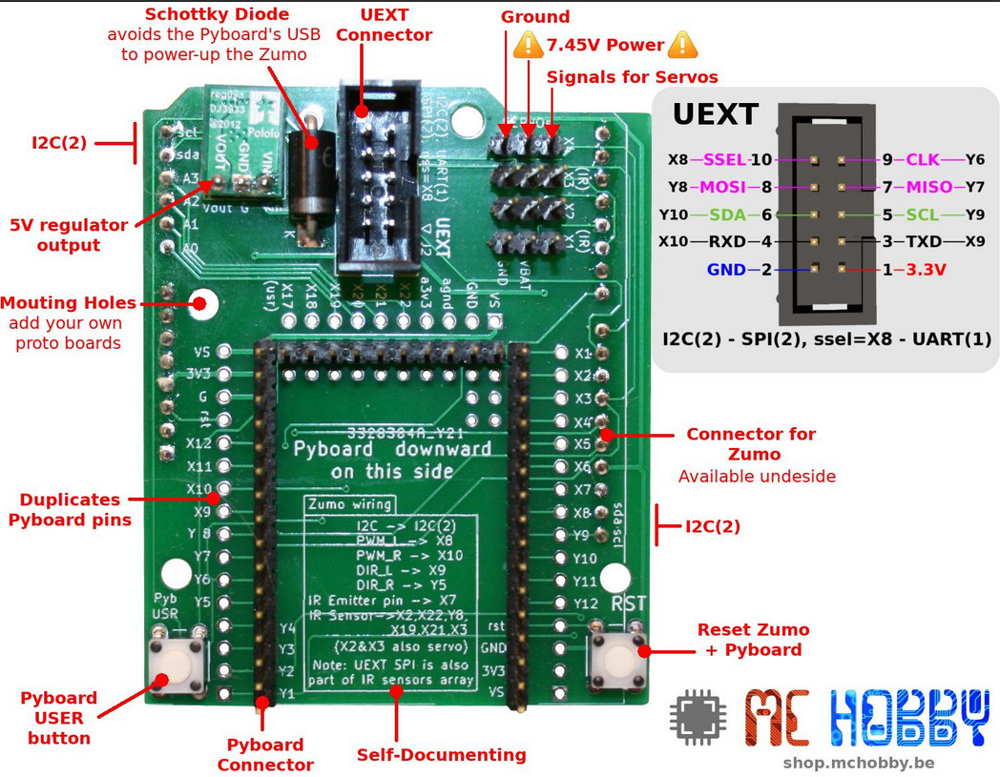
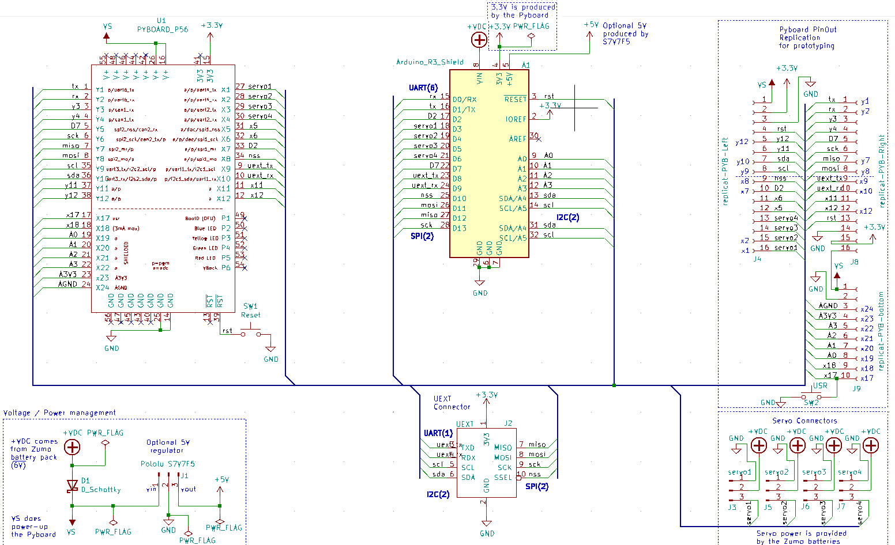

# Pyboard Zumo

The subfolder folder [grl-pyboard-zumo](grl-pyboard-zumo) is an adaptater board designed to control a __Zumo Robot for Arduino__ from a MicroPython Pyboard.

This folder contains gerber file and kicad design files. Be curious, there is also an extension board.

See also:

* [micropython-zumo-robot Github repository](https://github.com/mchobby/micropython-zumo-robot) for MicroPython source code.
* Product: [Pyboard to Zumo adapter](https://shop.mchobby.be/fr/micropython/2040-adaptateur-pyboard-pour-zumo-robot-3232100020405.html) (__deprecated__)
* [Pico to Zumo Robot adapter - Pico included - FR EBook included](https://shop.mchobby.be/en/micropython/2430-pico-to-zumo-robot-adapter-3232100024304.html)  

